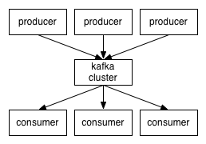

# Kafka, distributed streaming platform.

본 글은 [Apache Kafka official document - Introduction](https://kafka.apache.org/intro) 페이지의 내용을 요약 / 정리한 글입니다.

## Basic Concepts

- 하나 또는 그 이상의 물리적인 서버 상에 Cluster의 형태로 구동
- Kafka Cluster는 **Topic**이라 불리는 카테고리에 따라 **Record Stream**을 저장
- 각 Record는 key, value, timestamp로 구성됨
- 클라이언트와 서버 간의 통신은 TCP 프로토콜로 이루어짐

## Cord APIs - 주체들

- Producer: Topic 기반으로 Record Stream를 발행
- Consumer: Topic 기반으로 Record Stream을 구독
- Streams: Topic 기반으로 Record Stream을 구독, 가공하여 재발행
- Connector: Data System와 Kafka 간의 pull/push를 수행
- AdminClient: Topic, Broker 등의 Kafka 객체를 관리
- Legacy: Deprecated APIs

## Topic

- 카테고리, 또는 분류명
- Cluster 내 복수의 **Partition**에 **Offset**을 key로 하여 분산저장됨
- Cluster는 정의된 보관 기한 정책에 따라 발행된 Topic들을 보관하고 정의된 기간이 경과되면 삭제함
- Client-side 기준으로 Offset이 관리됨
    - 유연한 pull이 가능함 (구 데이터의 재구독, 특정 offset 만큼 스킵 등)
    - Consumer가 변경 될 때 Cluster 또는 타 Consumer의 부담이 적음
    - ex) 'tail' on cli: Virtually adding consumer on all topics?

## Distribution

- 각 Partition은 장애 복구를 위해 설정된 숫자(N) 만큼 복제되어 Cluster 내 각 서버에 분산 저장됨
- 각 Partition은 하나의 Leader 서버와 N개의 Follower 서버를 가짐 (Primary / Replica in ES?)

## Producers

- Topic 기반으로 데이터를 발행
- 어느 Partition으로 발행 할 것인지 결정
- 심플하게 Round-robin으로 할 수도, 특수한 분배를 위해 partition function 구성도 가능

## Consumers

- Consumer group name으로 Consumer를 그루핑
- 발행된 데이터는 Topic을 구독하는 Consumer Group 중 ***단 하나의*** Consumer에게만 전달됨
    - 동일한 Consumer Group에 속해 있을 경우: 하나의 Consumer에게만, 적절히 분배해서 전달
    - 다른 Consumer Group에 속해 있을 경우: 각 Consumer에게 전달
- Consumer group을 Consumer의 역할에 따라 적절하게 구성해야 할 필요가 있음
    - Queue / Publish - Subscribe Model, 특정 Topic 데이터의 발생 시간 순 처리 등
- Consumer group 내 Consumer 추가 또는 제거시 동적으로 파티션을 재분배함

## Multi-tenancy

- Topic 기준으로 발행 및 구독 권한 관리 가능

## Guarantees

- Producer는 항상 Partition의 Offset 기반으로 Topic을 발행
- Partition의 Offset 기반으로 Consumer가 구독하는 메시지의 순차적 영속성이 보장됨
- Replication factor가 N일 경우 N-1개의 Follower 서버가 존재, N-1번의 장애 복구 가능

## Kafka as a Messageing System

- 기존 Messaging System은 전통적으로 Queue 모델과 Publish/Subscribe 모델로 나뉘고, 각각 장단점이 존재
    - Queue: 프로세스 확장이 용이하나, Message가 일회용
    - Publish/Subscribe: 복수의 프로세스에 Message 전달이 가능하나, 동일한 Message가 전달됨
    - -> Kafka는 Consumer Group 관리를 통해 두 가지 모델을 함께 적용 가능
- 기존 Messaging System은 발행 과정이 병렬로 처리 될 경우 연속성이 유실 될 가능성이 존재했음
    - Topic 내 Partition을 기반으로 Consumer를 지정함으로써 연속성 보장과 부하 분산을 동시에 수행

## Kafka as a Storage System

- 데이터를 메모리에 저장하는 기존 Messaging System과 달리 파일시스템에 저장 [[참조: Don`t fear the filesystem!](https://kafka.apache.org/documentation/#design_filesystem)]
    > sequential disk access can in some cases be faster than random memory access!
    - 일반적으로 파일시스템은 메모리보다 느리지만, 잘 설계된 파일시스템은 느리지 않으며, 때때로 빠름
    - 메모리 사용을 피함으로써, Java 객체 사용 및 GC로 인한 오버헤드를 피함

## Kafka for Stream Processing

- 집계나 Stream 병합 등의 가공을 위해 별도의 Producer나 Consumer와 별도로 **Streams API**를 지원

## Putting the Pieces Together

- 중략

## 참조

- Official Document - Introduction [[Apache Kafka® is a distributed streaming platform. What exactly does that mean?](https://kafka.apache.org/intro)]
- Official Document - Design [[https://kafka.apache.org/documentation/#design](https://kafka.apache.org/documentation/#design)]
- [Apache Kafka] 1. 소개및 아키텍처 정리 [[http://epicdevs.com/17](http://epicdevs.com/17)]