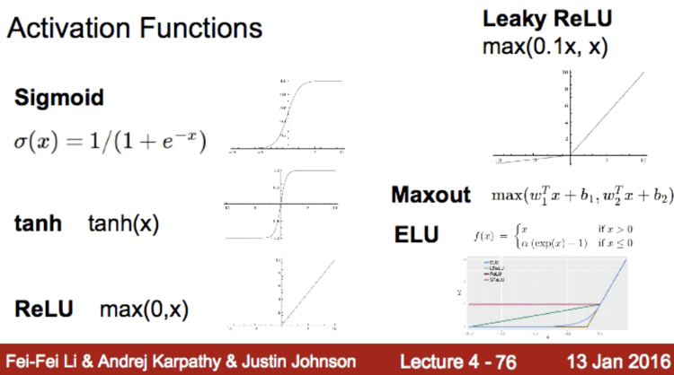
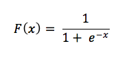
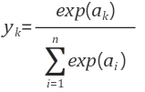

# Chapter 3. 신경망

## 일반적인 신경망의 구조

신경망의 가장 기본적인 형태는 입력층 / 은닉층 / 출력층으로 구성됨.
- 입력층: 데이터가 신경망으로 입력되는 부분.
- 은닉층: 입력층 또는 이전 노드에서 전달 받은 데이터를 처리해 다음 노드 또는 출력층에 전달할 결과값으로 반환해주는 노드들이 위치한 층.
- 출력층: 신경망을 통해 처리된 학습의 결과를 확인 할 수 있는 부분, 특정 라벨 - 예를 들어 사진이 입력되었을 경우 사진의 물체가 사람인지 개인지 고양이인지 - 의 확률을 구할 수 있음. (logistic, softmax, etc..) 

## 퍼셉트론의 복습과 활성화 함수

퍼셉트론은 이전 노드들로부터 신호를 전달 받아 가중치를 곱해 총 합을 구한 뒤, 편향을 고려하여 해당 노드의 출력값을 결정하는 구조.


퍼셉트론은 위 그림처럼 입력값을 종합하는 노드와 이를 신호로 치환하는 **활성함수**로 나눌 수 있음.

## 활성화 함수 - 계단 함수 vs 시그노이드 함수 vs 렐루(ReLU) 함수

- 계단 함수: 입력값에 따라 0 또는 1을 출력값으로 반환하는 함수
- 시그노이드 함수: 입력값에 따라 0에서 1까지를 출력값으로 반환하는 함수
- 렐루 함수: 입력값이 0 이하일 경우 0을, 0을 초과할 경우 입력값을 반환하는 함수 (계)
  - 최근에는 렐루 함수를 많이 사용함
  - [[Stack overflow - Why do we use ReLU in neural networks and how do we use it?](https://stats.stackexchange.com/questions/226923/why-do-we-use-relu-in-neural-networks-and-how-do-we-use-it)]
    - 계산 방식이 매우 간단: `return max(0, x)`, 음수는 0으로 고정되며 지수나 곱하기 나누기 등의 고비용의 연산 x
    - 0과 1 사이에만 국한되는 계산이 어느 선 이상 반복 될 경우 가중치?(gradient)가 사라지는 *Vanishing Gradient* 문제를 값을 보존하여 해결함
  - [[Sigmoid 보다 ReLU가 더 좋아](http://pythonkim.tistory.com/40)]
    - 윗 링크의 Vanishing Gradient에 대해 자세히 설명해주고 있음

공통점
- 비선형 함수
- 출력값이 0에서 1 사이
- 입력값이 작을수록 결과값이 0에 가까워지고, 입력값이 커질수록 결과값이 1에 가까워짐

차이점
- '매끄러움'의 차이
- 계단 함수는 0과 1만을, 시그노이드 함수는 연속된 실수를 결과값으로 반환



여러가지 다양한 활성화 함수들

## 시그모이드 함수를 왜 사용하는가?



- 로지스틱 회귀 함수라고도 함
- 선형으로 구성할 경우 은닉층을 다층으로 구성하는 이점이 없기 때문?
- 계단 함수에서의 선형 결과가 아닌 비선형 함수로 결과를 출력하기 위해서
- 수식화 하더라도 범위가 방대한 데이터를 0과 1 사이의 값으로 바꾸어주기 위해
  - 입력값을 양수로 바꾸어주기 위해 e^(-x)가 들어감 - 어떤 값이 x에 들어오든 양수가 됨
  - x가 클수록 확률이 증가하도록 하기 위해 e^(-x)가 분모에 들어감
  - x가 커지면:
    - e^(-x)는 작아지고
    - 1 / 1 + e^(-x)는 1에 가까워짐
  - x가 작아지면:
    - e^(-x)는 커지고
    - 1 / 1 + e^(-x)는 0에 가까워짐

## 다차원 배열 계산 with Numpy

행렬의 내적 연산 기본
- 노드의 가중치 계산을 보다 편리하게 수행하기 위해 사용
- 행렬의 형상에 주의: 행렬 A의 열 수 must equal 행렬 B의 행 수 ([1, "2"] dot ["3", 4])
- 내적 연산 결과의 형상은 행렬 A의 행 수 x 행렬 B의 열 수가 됨

> a x b * c x d = a * d (when b == c)

## 신경망 순방향 구현

p85-89에서의 두 행렬 내적 연산을 통한 기본적인 신경망 구현을 들여다보자. [참고링크](http://blog.naver.com/PostView.nhn?blogId=htk1019&logNo=220980094465)

```py
import numpy as np

# 입력층 - 첫 번째 은닉층

X = np.array([1.0, 0.5])                          # 입력층으로부터의 신호 (1 x 2)
W = np.array([[0.1, 0.3, 0.5], [0.2, 0.4, 0.6]])  # 입력층에서 첫 번째 은닉층으로의 간선 가중치 (2 x 3)
B = np.array([0.1, 0.2, 0.3])                     # 첫 번째 은닉층의 편향 (1 x 3)

# print절 생략

# 이전 노드들에서 가중치를 적용하여 합산된 값이 내적 연산으로 추출되고
# 이 때 내적 연산 결과의 형상은 1 x 3이 된다.
# 이후 브로드캐스팅을 통해 편향들이 각 내적값에 합산(+ B)된다.
A = np.dot(X, W) + B

print(A)
# 1.0 * 0.1 + 0.5 * 0.2 = 0.2 + (0.1) = 0.3
# 1.0 * 0.3 + 0.5 * 0.4 = 0.5 + (0.2) = 0.7
# 1.0 * 0.5 + 0.5 * 0.6 = 0.8 + (0.3) = 1.1
>>> [0.3, 0.7, 1.1]

# 시그모이드 함수 적용
Z = sigmoid(A)
>>> [0.57444252, 0.66818777, 0.75026011]

# 첫 번째 은닉층 - 두 번째 은닉층

W2 = np.array([[1.0, 0.4], [0.2, 0.5], [0.3, 0.5]]) # 첫 번째 은닉층에서 두 번째 은닉층으로의 간선 가중치 (3 x 2)
B2 = np.array([0.1, 0.2])                           # 두 번째 은닉층의 편향 (1 x 2)

A2 = np.dot(Z, W2) + B2       # 활성화 함수를 거치기 전의 입력 신호의 총 합
>>> [1.03315811, 1.13900095]  # 이 때 입력 신호의 총 합이 1 이상이 되는데
Z2 = sigmoid(A2)              
>>> [0.73755277, 0.75749616]  # 활성화 함수를 거치면서 0에서 1 사이의 값으로 조정된다.

# 출력층으로의 신호 전달도 동일하게
# 다만, 출력층에선 목적에 따라 활성화 함수를 다르게 적용한다. (항등 함수, 소프트맥스 함수 등)
```

## 출력층 설계 - 소프트맥스 함수

신경망의 목적 - 분류와 회기 - 에 따라 다른 활성화 함수를 출력층에 적용한다.

일반적으로 분류에는 소프트맥스 함수를, 회귀에는 항등 함수를 사용한다.

- 항등 함수: 입력값을 그대로 반환해주는 함수
- 소프트맥스 함수: n 번째 출력으로 n 번째 입력의 지수 함수를 모든 입력에 대한 지수 함수의 값으로 나눈 값을 내보내주는 함수



```py
def softmax(x):
  # np.exp(x) - 각 출력층의 입력값이 지수 함수를 거쳐 변환된 값
  # np.sum(np.exp(x)) - 모든 출력층의 입력값이 지수 함수를 거친 다음, 합산됨
  return np.exp(x) / np.sum(np.exp(x))

def softmax_enhanced(x):
  # overflow 문제를 해결하기 위해 임의의 정수를 빼준다.
  # 일반적으로 입력값 중 가장 큰 값을 빼준다고 함. - vanishing gradient?
  sub = x - np.max(x)
  return np.exp(sub) / np.sum(np.exp(sub))
```

결국 소프트맥스 함수의 출력값은:
- 모든 입력값으로부터 영향을 받으며
- 출력의 총 합은 1이 되므로 출력값 자체를 **확률**로 해석 할 수 있음
- 그래서 소프트맥스 함수는 분류 목적의 문제에 많이 사용된다.
- 소프트맥스 함수로 출력값 간의 대소 관계는 변하지 않고 / 분류는 가장 높은 확률을 정답으로 택하므로 확률로서의 의미가 없는 경우 불필요한 연산을 위해 소프트맥스 함수를 생략하기도 함

# 덧.

## 델타규칙

퍼셉트론을 통해 출력되는 값과 실제 값을 비교하여 차이가 생길 경우, 그 차이를 퍼셉트론에 반영(feedback)하여 편향과 가중치를 조정, 더 나은 출력값을 가질 수 있도록 학습을 시키는 것.

## 활성화 함수 - 소프트맥스 함수

노드의 출력값을 0~1 사이의 값으로 정규화하며 출력값들의 총합이 항상 1이 되는 함수 [링크](https://blog.naver.com/PostView.nhn?blogId=wideeyed&logNo=221021710286)

## 인공지능 구현의 이슈와 그 해결

너무 인간답지 못하게 학습한 나머지 모든 데이터를 외워버리는 Overfitting 문제
- Dropout
- Batch Normalization

학습하고 보니 우물 안 개구리가 되어서 빠져나가지 못하는 local minima 문제
- Backpropagation [링크](http://happycontrol.tistory.com/entry/%EC%97%AD%EC%A0%84%ED%8C%8C-%EC%95%8C%EA%B3%A0%EB%A6%AC%EC%A6%98BackPropagation-%EC%88%98%EC%97%85%EB%B2%84%EC%A0%84?category=482449)
- Pretraining: 데이터와 층을 미리 학습

## 머신러닝 데이터셋

- MNIST: 0-9 hand-writing images, 60,000 training dataset, 10,000 test dataset.
- CIFAR-10: 32x32 images, 50,000 training dataset, 10,000 test dataset. `airplane, automobile, bird, cat, deer, dog, frog, horse, ship, and truck`
- CIFAR-100: same as CIFAR-10 but separated in 100 classes with 20 super-classes.