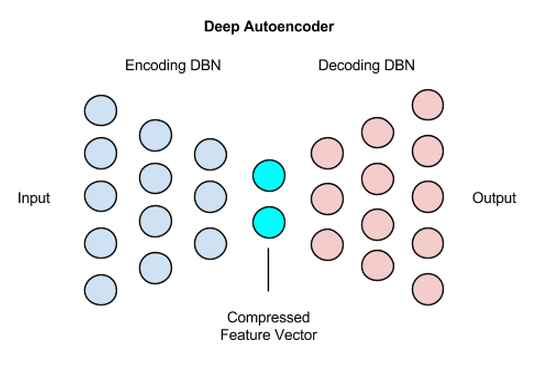
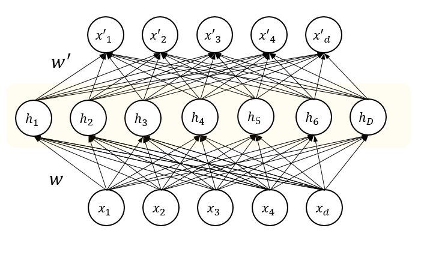
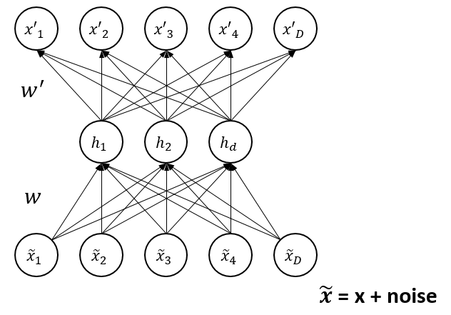

# AE 오토인코더

## 비지도학습

지금까지 진행했던 ANN(인공신경망), DNN(심층신경망), CNN(합성곱신경망), RNN(순환신경망)은 **지도학습**

- 지도학습이란: 정답이 존재하는 상태에서 학습

- 비지도학습이란: 명시적인 정답이 존재하지 않는 상태에서 학습

  - 라벨링 되지 않은 데이터로부터 패턴과 숨겨진 구조를 발견하는 것

  - 대표적인 비지도학습 알고리즘 - Clustering (군집화, 분류?)

- 오토인코더는 최초 비지도학습에서 반-지도학습으로?

## AE의 종류 [[Introduction Auto-Encoder - wikidocs.net](https://wikidocs.net/3413)]

1. Stacked Auto-Encoder

    

    기본적으로 두 개의 신경망으로 구성, 하나의 신경망은 입력층으로부터 전달된 데이터를 압축, 또 하나의 신경망은 복원을 담당

    압축 후 복원을 거치기 전의 중간값이 Feature Vector가 됨

    이 과정에서 압축 전의 입력값과 복원 후의 출력값이 최대한 같아지도록 튜닝함으로써 Feature를 잘 추출 할 수 있도록 하는게 AE의 목적

    **Greedy Layer-Wise Training**

    - Pre-training: 각 레이어 계층별 비지도학습 수행
    - Fine-tuning: 학습 완료 후 학습된 데이터들을 initialization, 이후 지도학습으로 수행

2. Sparse Auto-Encoder (sparseAE)

    

    입력층의 차원 수가 은닉층의 숫자보다 많은 경우 별도의 파라미터로 은닉층의 Activation 제어

    - Weight Decay Term (Vanishing Gradient 이슈 해결)
    - Sparsity Parameter (Node active/inactive 제어)
    - Additional Penalty Term? (Cross-Entropy?)

    사전학습한 정보에 기반한 판별을 회피하기 위함

3. Denoising Auto-Encoder (dA)

    

    기존의 AE모델이 입력값과 출력값이 일치하도록 튜닝
    
    "훌륭한 대표성을 가지는 데이터는 종속적인 데이터에서 안정적인 구조의 데이터를 뽑아내는 것"

    Denoising Auto-Encoder는 데이터의 유의미한 종속성을 학습시켜 데이터에 Noise가 추가되었을 때, Noise를 제거하고 원래의 데이터를 Extraction 하는 모델

## 오토인코더의 Use cases [[A Beginner's Guide to Deep Autoencoders - deeplearning4j.org](https://deeplearning4j.org/deepautoencoder)]

- 데이터 압축: 데이터의 추상화 - [[Semantic Hashing](https://www.cs.utoronto.ca/~rsalakhu/papers/semantic_final.pdf)]: 단순한 단어 매칭이 아닌, 문서의 단어를 Hashing 처리 한 후 저장 / 색인하여 검색 엔진의 Precision과 Recall을 향상시킨 사례

- 이미지 검색: 학습 과정에서 이미지들을 압축해 Feature Vectors를 추출, 이를 검색 엔진에서 이미지 검색을 위해 업로드 할 때 색인된 이미지들과 동일한 수준으로 압축한 다음 일치하는 이미지들을 찾아 검색 결과값으로 반환해줌

- Topic Modeling & Information Retrieval: 문서의 본문을 출현 단어의 빈도수를 기준으로 압축하여 주제를 추출 또는 특정 군으로 그루핑. 예를 들어 어떤 글은 AE모델을 통해 '질문' 글로 분류 될 수 있고, 또 어떤 글은 '답변' 글로 분류 될 수 있음

- 책에서는 "데이터 압축, 저차원화를 통한 데이터 관계 관찰, 배경 잡음 억제" 등을 이야기하고 있음

## 덧

주성분분석: Principle Component Analysis [[ratsgo's blog](https://ratsgo.github.io/machine%20learning/2017/04/24/PCA/)]
- PCA는 데이터의 분산(variance)을 최대한 보존하면서 서로 직교하는 새 기저(축)를 찾아, 고차원 공간의 표본들을 선형 연관성이 없는 저차원 공간으로 변환하는 기법입니다.. 여기서 패스.

  

RBM: Restricted Boltzmann Machine [[deeplearning4j.org](https://deeplearning4j.org/kr/restrictedboltzmannmachine)]
- 입력층과 은닉층으로 구성
- 같은 층 내부 노드 간의 연결은 없고 층과 층 사이의 연결만 존재
- 입력층은 은닉층으로의 데이터 전달 여부를 확률적으로 결정

DBN: Deep-Belief Network [[deeplearning4j.org](https://deeplearning4j.org/kr/restrictedboltzmannmachine)]
- RBM을 맨 아래 data layer부터 차근차근 stack으로 쌓아가면서 전체 parameter를 update하는 모델이다.

오토인코더 적용 사례 - [[오토인코더를 이용한 신용카드 비정상 거래 검출 모델의 구현](http://bcho.tistory.com/1197)]

[[늦게 찾은 좋은 소스](https://laonple.blog.me/220884698923)]
